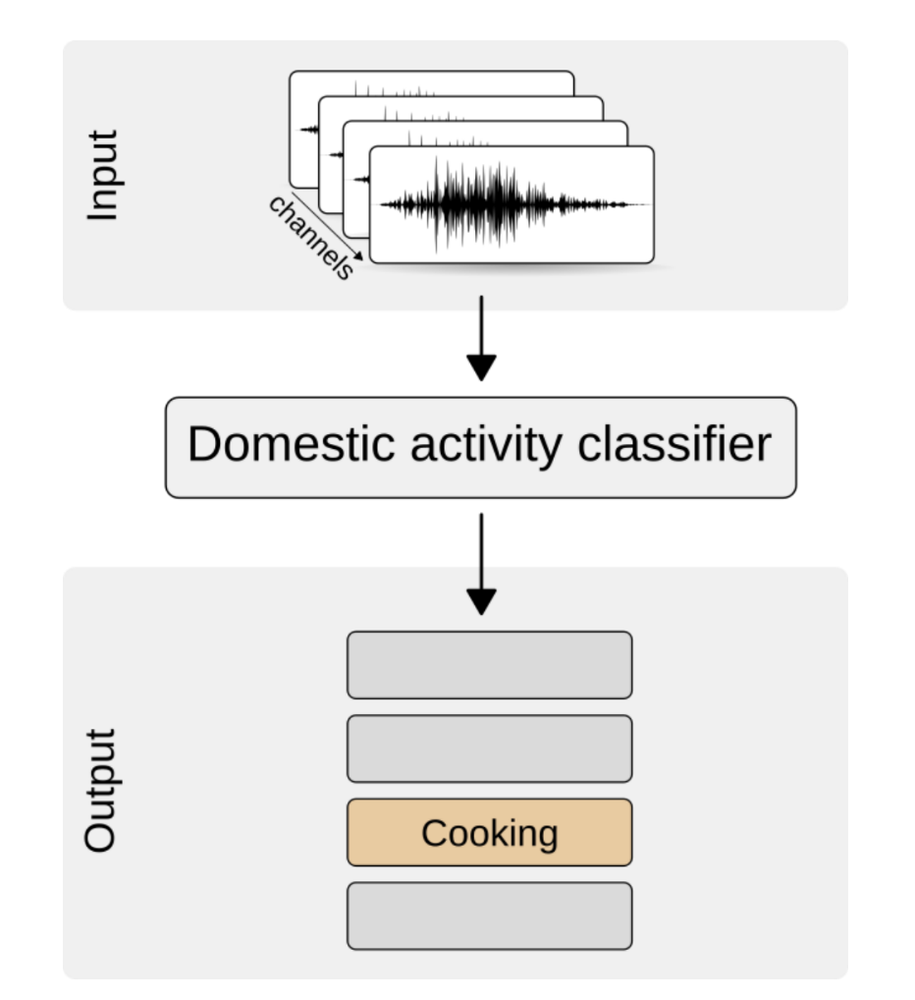
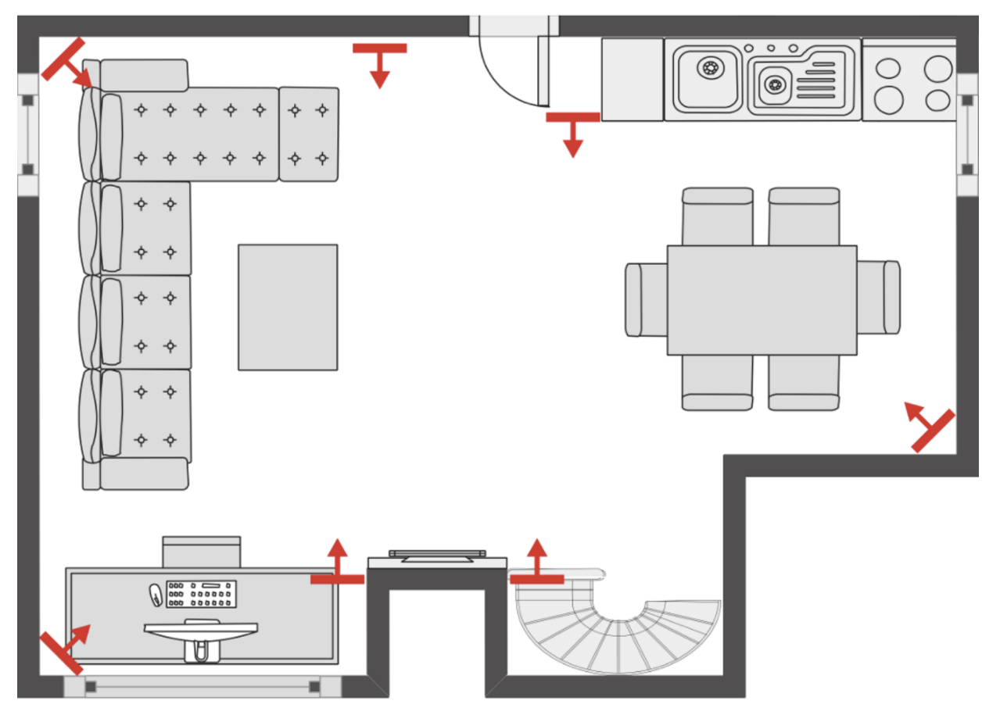

# Monitoring of domestic activities based on multi-channel acoustics

**The problem definition and project are based on the baseline system provided by [Task 5](https://dcase.community/challenge2018/task-monitoring-domestic-activities-results#Inoue2018) from the [DCASE2018 Challenge](https://dcase.community/challenge2018).**\
**This repository contains an implementation, study and minimal modifications of this baseline system.**

Acoustic scene classification (ASC) of daily activities performed in a home environment (e.g. Cooking). The provided samples are multi-channel audio segments acquired by multiple microphone arrays at different positions. This means that spatial properties can be exploited to serve as input features to the classification problem. However, using absolute localization of sound sources as input for the detection model is doomed to not generalize well to cases where the position of the microphone array is altered. Therefore, in this task, the focus is on systems which can exploit spatial cues independent of sensor location using multi-channel audio. 

The dataset used in this task is a derivative of the [SINS dataset](https://zenodo.org/record/1247102). It contains a continuous recording of one person living in a vacation home for over one week. It was collected using a network of 13 microphone arrays distributed over the entire home. Further information on the challenge as well as the dataset can be found [here](https://dcase.community/challenge2018/task-monitoring-domestic-activities).

  
  

*Figure 1. DCASE2018 Challenge Task 5 & Figure 2. 2D house plan*

## Getting started

1. Install requirements with command: ``pip install -r requirements.txt``. 
2. Run the application with default settings: ``python task5.py``
3. The code is mainly using the [DCASE util](https://dcase-repo.github.io/dcase_util/) library.

**Note:** The baseline has been tested on CentOS Linux 7.4 and Windows 7 using Python 3.6 and TensorFlow 1.4. 

## File structure
The baseline system provides an entry-level approach which is simple but relatively close to the state-of-the-art systems (in 2018).

### Code summary
The file `task5.py` contains the main code of the baseline system and is largely controlled by the configuration file `task5.yaml`. The code handles downloading and reading the dataset, calculating the features and models and evaluating the results. The code is commented to assist in understanding the structure. 

    .
    ├── task5.py                # main code
    ├── task5.yaml              # configuration file (system state machine control, baseline parameters, ...)
    ├── task5_datagenerator.py  # data generator class
    ├── task5_utils             # some additional functions used in the baseline system code
    ├── README.md               # this file
    └── requirements.txt        # external module dependencies 

**Note**: By default, the code is set to `development mode`. In development, mode results are acquired in 4-fold cross-validation-based fashion. The code provides an option to change to `evaluation mode` which then uses the full training dataset to train a model to be tested on the evaluation dataset. The option for `evaluation mode` is available in the configuration file (`eval_mode: True/False`).

### Feature/Machine Learning parameters

During the recording campaign, data was measured simultaneously using multiple microphone arrays (nodes) each containing 4 microphones.  Hence, each domestic activity is recorded as many times as there were microphones.  The system trains a single classifier model that takes a single channel as input.  Each parallel recording of a single activity is considered a different example during training. The learner is based on a Neural Network architecture using CNN and Dense layers. As input, log mel-band energies are provided to the network for each microphone channel separately. In the prediction stage, a single outcome is computed for each node by averaging the 4 model outcomes (posteriors) that were computed by evaluating the trained classifier model on all 4 microphones.

The system parameters are as follows:

- Frame size: 40 ms (50% hop size)
- Feature matrix: 
    - 40 log mel-band energies in 501 successive frames (10 s)
- Neural Network:
    - Input data: 40x501 (each microphone channel is considered to be a separate example for the learner)
    - Architecture:
        - 1D Convolutional layer (filters: 32, kernel size: 5, stride: 1, axis: time) + Batch Normalization + ReLU activation
        - 1D Max Pooling (pool size: 5, stride: 5) + Dropout (rate: 20%)
        - 1D Convolutional layer (filters, 64, kernel size: 3, stride: 1, axis: time) + Batch Normalization + ReLU activation
        - 1D Global Max Pooling + Dropout (rate: 20%)
        - Dense layer (neurons: 64) + ReLU activation + Dropout (rate: 20%)
        - Softmax output layer (classes: 9)
    - Learning:
        - Optimizer: Adam (learning rate: 0.0001)
        - Epochs: 500
        - On each epoch, the training dataset is randomly subsampled so that the number of examples for each class matches the size of the smallest class
        - Batch size: 256 * 4 channels (each channel is considered as a different example for the learner)
- Fusion: Output probabilities from the four microphones in a particular node under test are averaged to obtain the final posterior probability.
- Model selection: The performance of the model is evaluated every 10 epochs on a validation subset (30% subsampled from the training set). The model with the highest Macro-averaged F1-score is picked.

The baseline system is built on the [dcase_util](https://github.com/DCASE-REPO/dcase_util) toolbox. The machine learning part of the code is built on [Keras (v2.1.5)](https://keras.io/) while using [TensorFlow (v1.4.0)](https://www.tensorflow.org/) as the backend.

### Baseline performance and results
When running in development mode (`eval_mode = False`) the baseline system provides results for a 4-fold cross-validation setup. The table below shows the averaged `Macro-averaged F1-score` over these 4 folds. The F1-score is calculated for each class separately and averaged over all classes to obtain the `Macro-averaged F1-score`. A full 10s multi-channel audio segment is considered to be one sample. 

<table class="table table-striped">
    <thead>
        <tr>
            <th>Activity</th>
            <th class="col-md-3">F1-score</th>
        </tr>
    </thead>
    <tbody>
        <tr>
            <td>Absence</td>
            <td>84.23 %</td>
        </tr>
        <tr>
            <td>Cooking</td>
            <td>96.52 %</td>
        </tr>
        <tr>
            <td>Dishwashing</td>
            <td>78.56 %</td>
        </tr>
        <tr>
            <td>Eating</td>
            <td>85.54 %</td>
        </tr>
        <tr>
            <td>Other</td>
            <td>35.43 %</td>
        </tr>  
        <tr>
            <td>Social activity</td>
            <td>96.48 %</td>
        </tr>
        <tr>
            <td>Vacuum cleaning</td>
            <td>97.66 %</td>
        </tr> 
        <tr>
            <td>Watching TV</td>
            <td>99.4 %</td>
        </tr>
        <tr>
            <td>Working</td>
            <td>82.96 %</td>
        </tr>                                                                 
    </tbody>
    <tfoot>
        <tr>
            <td><strong>Macro-averaged F1-score</strong></td>
            <td><strong>84.50 %</strong></td>
        </tr>
    </tfoot>
</table>

## Development process

The research and execution of the system have three main phases:

### 1. Basic study
Firstly, a basic study is carried out on the structure of the 4 channels of each audio, analyzing the basic characteristics extracted by the system, which are the input of the neural network. A primitive listening analysis of the audio is also carried out, to recognize the periodicity and seasonality of the signal, for each of the 9 categories to be classified. The study is carried out on a reduced version of the SINS dataset, which we call DBmicro, formed by the extraction of 0.1%, corresponding to 72 audios, of the total 72,983 audios. The total of the database is called DBfull, corresponding to an approximate size of 89 GB.

## 2. Initial Baseline system implementation
The first implementation of the Baseline system is executed locally on a reduced version of the SINS dataset called DBmini. This dataset is made up of 1% of the DBfull. The execution of the program allows us to perform a basic study on the feature extraction and normalization processes:

### 2.1. Feature extraction

To be able to perform an effective classification of the different categories, it is necessary to perform an appropriate extraction and processing of the features. Instead of processing each 10-second segment each time, the system first divides each segment into frames, smaller overlapping-sized sections of fixed size, which allow the division of the 4 channels.

Although this segmentation is necessary for performing transformations to reduce the variability of the input data, produce useful features, or obtain computational efficiency, a better justification for feature extraction in segments, is that humans (whose Human Auditory System (HAS) perception we are trying to capture) also process audio in small extracts. For this representation, we use Mel Frequency Cepstral Coefficients (MFCC). These are the necessary steps to obtain this representation:

1. **Frame segmentation**: From each 10s segment we extract 40 ms frames, with 50% overlapping. For the frames to be considered stationary, these need to be short, which provides a constant frequential distribution. It's important to note that for vocal signals, we usually would take frames between 10 to 20 ms. However, in acoustic scenes, we don't perceive significative changes with these times, for this reason, we use 40 ms. This results in a total of 501 frames.
2. **Asymmetric Hamming windowing**: Each frame is multiplied by a Hamming window to minimize the spectral loss of energy on the neighbouring containers, as well as reducing discontinuities at the ends of the window which can generate unwanted high frequency components.
3. **Fast Fourier Transform (FFT)**: An FFT is applied to each frame to obtain the energy distribution in frequencies, as well as the phase. The FFT is performed with 1024 samples.
4. **Magnitude Spectrum**: The phase information is discarded by taking the absolute value of each complex value of the frequency bin. The HAS can be considered to be “phase deaf” under certain circumstances, indicating that the magnitude is more important than the phase.
5. **Mel Scale**: The frequencies are mapped to a perceptual tone scale - the Mel Scale - in intervals between 50 Hz, for the lower frequency, and 8000 Hz, for the higher frequency. High frequencies are perceived logarithmically, therefore are discarded as these cannot be resolved with the same accuracy and don't provide that much information for the acoustic scene. The Mel Scale is also used for dimensionality reduction: the
frequency bins of the magnitude spectrum, of 1024 samples, are mapped to the corresponding 40 Mel bands.
6. **Log**: The logarithmic function is applied to Mel magnitudes. There are two motivations behind this process: (1) the perception of the human auditory system by volume is logarithmic; (2) the logarithm transforms the product of the two parts of the audio (the source and the filter) into a sum, which is easier to separate.
7. **Discrete Cosine Transform (DCT)**: We can extract the envelope of the spectral magnitudes by applying the DCT to each of the frames with the log mel magnitudes.

<i>Figure 3. MFCC log espectrograms for each class</i>

**Activities**: 0-absence; 1-cooking; 2-dishwashing; 3-eating; 4-others; 5-social activities; 6-vacuum cleaning; 7-watching TV; 8-working

MFCCs describe the spectral envelope of small frames of a signal. Once finished with the previous process we get a matrix representation of each segment of 10s. Dimensions are 40 × 501 samples - 40 log mel coefficients for each one of the 501 frames.

### 2.2. Normalization
Normalization is necessary to get a roughly proportional contribution from each characteristic and to improve the gradient descent algorithm. Outliers are very frequent in acoustic scenes, therefore using standardization (instead of normalization) prevents the outputs from being compressed to a narrow interval. 

## 3. Full Baseline system implementation
The system has been implemented on the BDfull, with all the data being used. The main modifications from the Baseline system are the enlargement of the windowing, growing from 40 ms to 80 ms and overlapping of 50%. This requires modifications on the input layer from the NN, as well as the number of FFT coefficients to be extracted from the frames.

Homogeneous classes are observed during the basic study (e.g., 6-vacuum cleaning, or 2-dishwashing). Other classes, however, display punctuated frequencies and sudden events, which seem to be unsusceptible for improvement in the face of this modification. The windowing modification results in improvements in the classes of 1-cooking, 2-dishwashing, 4-others, 5-social activities, 6-vacuum cleaning, and 7-watching TV. While the Macro-averaged F1-Score drops from 84.09 to 83.81, this is caused by the drop from two classes: 0-absence and 3-eating.

These are the end results:

| Activity                | F1-score Baseline | F1-score Modifications |
|-------------------------|-------------------|------------------------|
| Absence                 | 84.23%            | 82.37%                 |
| Cooking                 | 96.52%            | 96.85%                 |
| Dishwashing             | 78.56%            | 78.83%                 |
| Eating                  | 85.54%            | 82.89%                 |
| Other                   | 35.43%            | 36.48%                 |
| Social activity         | 96.48%            | 96.57%                 |
| Vacuum cleaning         | 97.66%            | 99.17%                 |
| Watching TV             | 99.40%            | 99.47%                 |
| Working                 | 82.96%            | 81.65%                 |
| Macro-averaged F1-score | 84.09%            | 83.81%                 |

